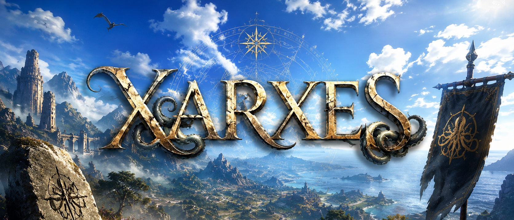

<picture>
  <source
    media="(prefers-color-scheme: dark)"
    srcset="./docs/Images/XARXES-dark.png"
  >
  <source
    media="(prefers-color-scheme: light)"
    srcset="./docs/Images/XARXES-light.png"
  >
  
</picture>

- - - - - - - - - - - - - - - - - - - - - - - - - - - - - - - - - - -

# ❗️ Дисклеймер / Disclaimer ❗ ️

> **Важно:** Проект является **учебной симуляцией (курсовой работой)** и разработан исключительно в демонстрационных и
> научно-образовательных целях. Приложение представляет собой изолированную модель и не является коммерческим продуктом.

Интеграция с реальным API Nexus Mods и Steam отсутствует. В целях демонстрации:

* Вся БД реализуется как локальные наборы конфигураций `JSON`.
* Менеджер модификаций (Oghma) не производит физическую инъекцию файлов в директории реальных установленных игр. Все
  файлы модов заменены на легковесные текстовые суррогаты (`.txt`) без нарушения логики работы
  приложения.

- - - - - - - - - - - - - - - - - - - - - - - - - - - - - - - - - - -

# 🌌 Xarxes (ex-Synapse)

**Xarxes** (ранее *Synapse*) — десктопное приложение на Java/JavaFX, для автоматизации загрузки, установки и контроля
целостности игровых модификаций. Система исключает необходимость ручной
распаковки архивов и ручного контроля бесконфликтности файлов.

- - - - - - - - - - - - - - - - - - - - - - - - - - - - - - - - - - -

## 🏗️ Архитектура системы (Триединство)

1. **Hermaeus** *(ранее Nexus)* - репозиторий для хранения модификаций

2. **Oghma** *(ранее Vortex)* - менеджер модификаций. Управляет профилями, установкой модов, выстраиванием приоритета и
   динамическим разрешением конфликтов.

3. **Xarxes** *(ранее Synapse)* - платформа для взаимодействия Oghma & Hermeaus. Отвечает за авторизацию, сессии и
   графический интерфейс.

- - - - - - - - - - - - - - - - - - - - - - - - - - - - - - - - - - -

## 📈 JavaFx-gui branch (WIP)

В рамках текущего этапа проведен глубокий архитектурный рефакторинг, переведя проект от `CLI` до полноценной реализации
графического интерфейса на `JavaFX`

- - - - - - - - - - - - - - - - - - - - - - - - - - - - - - - - - - -

*Подробная документация по соответствующим темам доступна в `docs`*

🔮 Лингвистический Апокриф: почему именно так?

Если вы попытаетесь прочитать названия модулей этого проекта вслух, не являсь лингвистом, у вас может свести челюсть.
Вот забавная история, как транслитерация здесь проиграла живой истории:

### 👑 Xarxes ➔ Заркс (а не Ксарксес)**

* *По коду:* Центральное ядро.
* *По лору:* [маг-альдмер](https://elderscrolls.fandom.com/ru/wiki/Заркс), бог предков и тайного знания. Начал
  карьеру
  летописцем [Аури-Эля](https://elderscrolls.fandom.com/ru/wiki/Акатош), но по истечении времени
  он обратил свой взор к другим источникам знаний — [даэдра](https://elderscrolls.fandom.com/ru/wiki/Даэдра_(Lore)).
  Как и почему он стал сотрудничать со своим новым
  господином — [Хермеусом Морой](https://elderscrolls.fandom.com/ru/wiki/Хермеус_Мора), неизвестно. Однако благодаря
  этому союзу
  была написана [Огма Инфиниум](https://elderscrolls.fandom.com/ru/wiki/Огма_Инфиниум).
* *По языку:* Да, в латыни есть пример, где надо говорить "
  Ксарксес" ([Ксеркс I](https://ru.wikipedia.org/wiki/Ксеркс_I) -
  персидский царь, чье имя греки записали через букву «Кси» ($\Xi$),
  которая в латыни стала буквой **X**). Но тут работают два правила:

*
    * Академическое (Ксарксес): В русском языке все древнегреческие и латинские имена, начинающиеся на X,
      традиционно
      переводятся через «Кс» (Xerxes ➔ Ксеркс, Xenophon ➔ Ксенофонт). Поэтому официально в русском языке слово
      `Xarxes`
      МОЖНО прочитать как Ксарксес.

*
    * Живое английское (Заркс): В живом английском есть жесткое фонетическое правило: буква **X** в начале слова
      обычно читается как **[z]** ([Xerox ➔ Зирокс](https://ru.wikipedia.org/wiki/Xerox), Xena ➔
      Зина). Именно поэтому англоязычные игроки в свитках говорят не «Ксарксес», а «Заркс» (или «Зарксис»).

### 🐙 **Hermaeus ➔ Хермеус (а не Хермаеус)**

* *По коду:* Каталог модов.
* *По лору:* [Хермеус Мора](https://elderscrolls.fandom.com/ru/wiki/Хермеус_Мора), принц даэдра, повелитель знаний.
* *По языку:* В древней латыни буквосочетание **«ae»** — это неделимый дифтонг. В позднелатинской и традиционной
  европейской передаче дифтонг «ae» обычно упрощается до звука
  «е» ([Caesar ➔ Цезарь](https://ru.wikipedia.org/wiki/Гай_Юлий_Цезарь), [Daemon ➔ Демон](https://ru.wikipedia.org/wiki/Демон)).
  Поэтому буквосочетание `maeu` превращается в мягкое русскоговорящее «меу». Почему не Hermeys? Потому что `-us` —
  это классическое латинское окончание мужского рода (
  как [Юлиус ➔ Julius](https://ru.wikipedia.org/wiki/Юлиус), [Августус ➔ Augustus](https://en.wikipedia.org/wiki/Augustus_%28given_name%29)).
  Если бы мы написали `Hermeys`, слово бы потеряло свой монументальный античный стиль и превратилось бы в какой-то
  современный американский бренд кросовок.

### 📖 **Oghma ➔ Огма (а не Огхма)**
* *По коду:* Локальный менеджер.
* *По лору:* [Огма Инфиниум](https://elderscrolls.fandom.com/ru/wiki/Огма_Инфиниум) — великая и таинственная Книга
  Знаний, написанная Зарксом и наполненная знаниями, которые он получил от Хермеуса Моры.
* *По языку:* Имя уходит корнями в кельтский (древнеирландский) язык
  богов. [Огма](https://ru.wikipedia.org/wiki/Огма) — бог в кельтской мифологии, олицетворявший знания, красноречие,
  поэзию и изобретатель огамического письма. (и, соответственно, книга Огма Инфиниум). В кельтских языках и в
  древнеанглийском буквосочетание **«gh»** использовалось для
  передачи мягкого, глухого придыхательного звука (похожего на [южнорусское «г»](https://dzen.ru/a/YhVI8rkNcCb-jFK2)
  или немецкое «ch» [ɪç-laʊt]). Со временем в английском языке этот звук либо вообще отмер и перестал читаться (как
  в словах light, night,
  though), либо превратился в «ф» (enough [ɪˈnʌf], laugh [lɑːf]). В имени Oghma буква h — это просто «призрак»
  древнего произношения. Русская традиция передачи обычно его опускает или упрощает, поэтому мы его просто
  игнорируем и пишем твердую, удобную для выговора «г». Написание `Ogma` в
  английском коде — плоско и потеряло бы свой исторический шарм, а говорить «Огхма» — больно для ушей. Поэтому пишем
  с уважением к истории, а говорим мягко: **Огма**.

